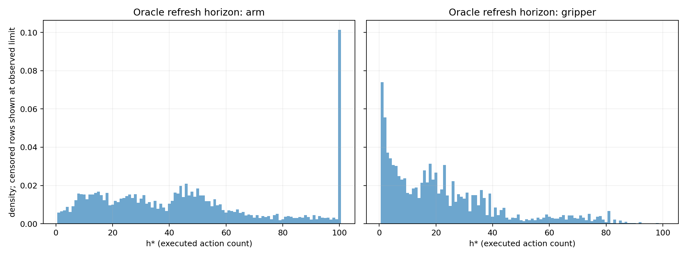
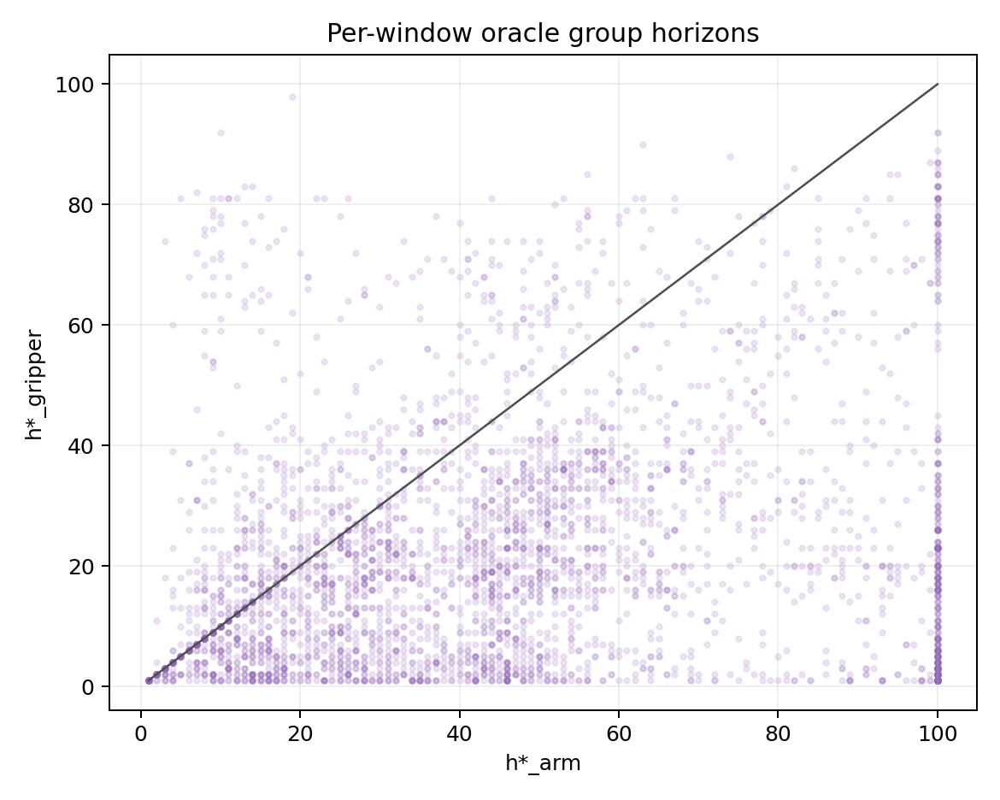
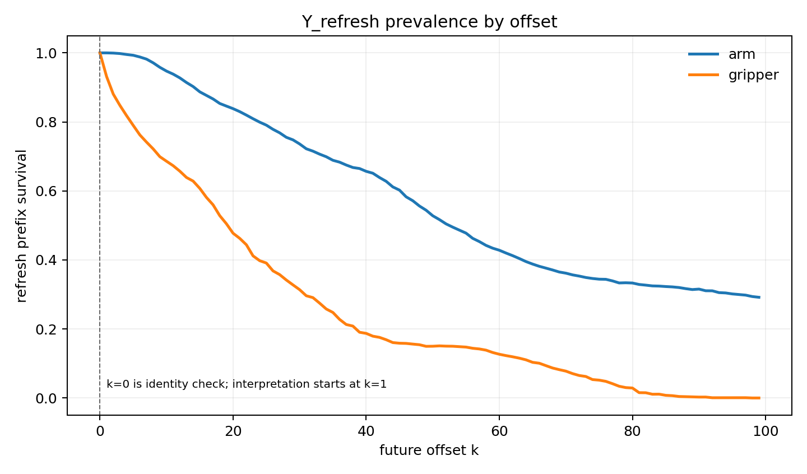

# Oracle group-horizon analysis

## Decision-relevant result

The cached `Y_refresh` targets provide an offline, right-censored oracle for group-specific temporal persistence. The result is descriptive only: it is not a learned horizon label, rollout-success supervision, or a closed-loop execution measurement.

The action-count convention is `h* = max { h >= 1 : Y_refresh(h-1) remains true }`. Offset `k=0` supplies only the minimum one-action convention; positive evidence begins at `k=1`. Rows valid through the last observed action are right-censored.

Rows: 3740; episodes: 454; positive-offset uncensored comparison rows: 1918.

## Group distributions

| group | mean | median | q10 | q25 | q75 | q90 | censoring |
|---|---:|---:|---:|---:|---:|---:|---:|
| arm | 45.05 | 42.0 | 10.0 | 21.0 | 61.0 | 100.0 | 0.484 |
| gripper | 22.36 | 18.0 | 2.0 | 6.0 | 32.0 | 52.0 | 0.059 |

These are lower-bound distributions because censored rows are displayed at their last observed action count. The report and JSON also include uncensored-only summaries.

## Heterogeneity and global-clock waste

| comparison population | arm expires first | gripper expires first | equal | different |
|---|---:|---:|---:|---:|
| all rows (lower-bound) | 0.162 | 0.761 | 0.077 | 0.923 |
| both uncensored | 0.310 | 0.649 | 0.041 | 0.959 |

On the both-uncensored subset, forcing both groups to the shorter oracle clock discards a mean of 23.06 valid action positions per window (median 17.0); the discarded fraction is 0.409 of the two groups' observed oracle commitment. This is commitment discarded by the global clock, not a success gain.

## Offset prevalence

The complete per-offset pointwise and prefix-survival arrays are in `oracle_group_horizon_metrics.json`. Selected refresh prefix-survival values are:

| offset k | arm | gripper | observed rows |
|---:|---:|---:|---:|
| 1 | 1.000 | 0.931 | 3718 |
| 2 | 0.999 | 0.881 | 3696 |
| 4 | 0.995 | 0.818 | 3652 |
| 8 | 0.971 | 0.722 | 3576 |
| 16 | 0.877 | 0.581 | 3441 |
| 32 | 0.715 | 0.291 | 3143 |
| 64 | 0.395 | 0.111 | 2153 |
| 99 | 0.292 | 0.000 | 1299 |

## Task and offline phase variation

Task and normalized-episode-phase summaries are retrospective analyses. Progress, phase, and terminal episode length were not used to select a PACE horizon and must not be estimator inputs.

### Task-conditioned lower-bound distributions

| task | rows | arm mean | gripper mean | arm censoring | gripper censoring |
|---|---:|---:|---:|---:|---:|
| pick up the alphabet soup and place it in the basket | 376 | 41.02 | 15.92 | 0.444 | 0.080 |
| pick up the bbq sauce and place it in the basket | 379 | 42.59 | 28.30 | 0.354 | 0.040 |
| pick up the butter and place it in the basket | 389 | 45.97 | 29.94 | 0.504 | 0.067 |
| pick up the chocolate pudding and place it in the basket | 427 | 54.49 | 26.76 | 0.630 | 0.054 |
| pick up the cream cheese and place it in the basket | 365 | 38.75 | 21.48 | 0.425 | 0.058 |
| pick up the ketchup and place it in the basket | 375 | 42.97 | 18.52 | 0.411 | 0.045 |
| pick up the milk and place it in the basket | 361 | 53.47 | 18.66 | 0.551 | 0.039 |
| pick up the orange juice and place it in the basket | 362 | 37.29 | 17.48 | 0.378 | 0.047 |
| pick up the salad dressing and place it in the basket | 361 | 45.03 | 27.05 | 0.488 | 0.058 |
| pick up the tomato sauce and place it in the basket | 345 | 47.67 | 18.10 | 0.646 | 0.104 |

### Offline phase-conditioned lower-bound distributions

| phase | rows | arm mean | gripper mean | arm censoring | gripper censoring |
|---|---:|---:|---:|---:|---:|
| early | 1091 | 56.37 | 13.80 | 0.284 | 0.000 |
| late | 1314 | 27.99 | 15.38 | 0.752 | 0.162 |
| middle | 1335 | 52.59 | 36.24 | 0.384 | 0.005 |

Full quantiles, uncensored-only strata, and per-stratum heterogeneity are in `oracle_group_horizon_metrics.json`.

## Figures

## Limitations

- `Y_refresh` queries the frozen policy on a demonstrated future observation; it does not execute the old action in an environment.
- Censoring and teacher forcing prevent interpreting `h*` as a physical safety or task-success horizon.
- Group comparison is exact only when both group prefixes fail before their observed suffix ends; all-row rates are explicitly lower-bound comparisons.
