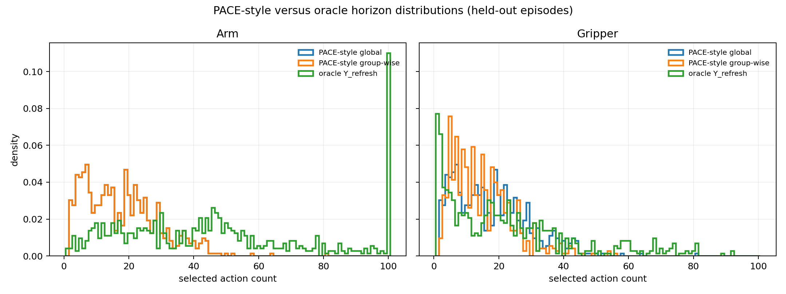
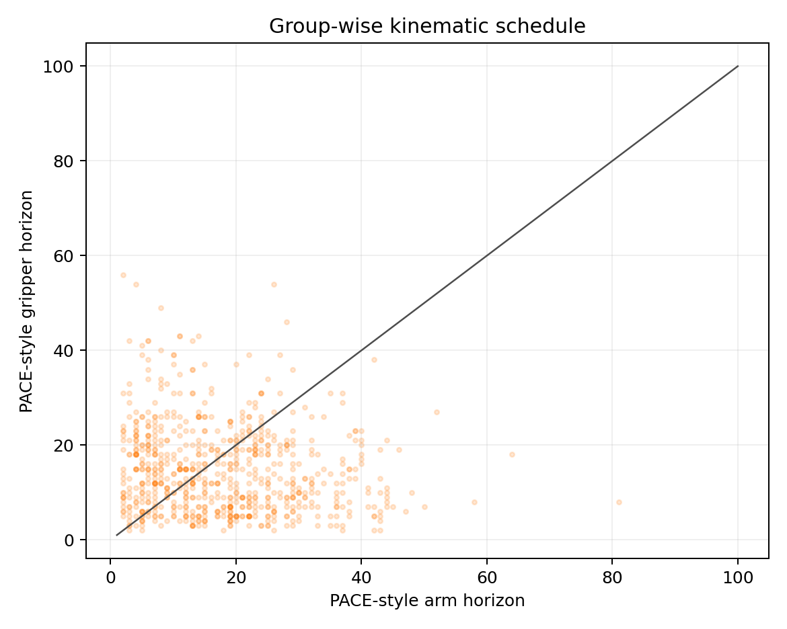

# Related-work execution audit and PACE-style baseline

## Scope and conclusion

This is an offline audit over cached frozen-policy chunks and `Y_refresh`. No estimator training, online reinforcement learning, executor change, or rollout was performed. No success claim is made.

The inspected prior work establishes that dynamic execution-horizon selection, confidence/self-consistency signals, kinematic phase signals, and frozen-policy scheduling are already active ideas. Accordingly:

1. **Reliability -> dynamic horizon is not claimed as novel.** The burden of proof is not met by the current comparison.
2. The potentially defensible distinction is the combination of **heterogeneous group-wise temporal persistence, independent execution clocks, and mixed-generation action composition**. The inspected papers use a scalar/global commitment or a policy-internal/training-time horizon mechanism; this combination remains a provisional positioning statement, not a novelty claim.
3. A single global clock measurably discards non-expired group commitment in this cache when evaluated against `Y_refresh`; see the oracle report. This is an offline upper-bound diagnostic, not an execution improvement.
4. The group-wise PACE-style heuristic is not a faithful PACE reproduction and does not establish that kinematics solve the oracle gap. It should be read as a diagnostic of how much a simple chunk-only signal can explain.

## Method matrix

| method | horizon meaning | target / signal | training required | frozen base policy | policy-internal access | online RL | global or independent groups | retain non-expired old source chunk | inference overhead | overlap |
|---|---|---|---|---|---|---|---|---|---|---|
| [PACE](https://arxiv.org/html/2606.00537) | executed prefix before next query | smoothed predicted arm kinematic profile; prominent low-speed valleys | no; task threshold calibrated from demonstrations | yes | no | no | one scalar; earliest accepted arm boundary | no; suffix is discarded and the global query refreshes together | small profile/smoothing/valley computation | closest chunk-only timing baseline; not group clocks |
| [VLA Knows Its Limits / AutoHorizon](https://arxiv.org/html/2602.21445) | per-chunk executed prefix | action self-attention coverage/turning point from flow-VLA attention | no additional training for the reported test-time method | yes | yes; attention maps are required | no | one scalar prefix | no | low relative to policy, but requires attention extraction | adaptive horizon from internal predictive-limit proxy |
| [DEHP](https://arxiv.org/abs/2606.11408) | predicted number of actions to execute before replanning | learned execution-horizon branch optimized with chunk-level PPO | yes; online RL | yes; pretrained chunk policy frozen | designed for black-box chunk policies | yes | one scalar horizon | no group retention semantics | lightweight branch plus RL-trained scheduler | closest learned frozen-policy scheduler, but objective/training differs |
| [Spatial Attention](https://arxiv.org/html/2607.04739) | execution horizon under a sampling budget | observation sensitivity `E||grad_o log pi(a|o)||^2`, forecast along chunk | yes; score models/forecasting machinery | base policy can remain fixed, but auxiliary models are trained | not a black-box-only signal; action/observation likelihood sensitivity is required | no | scalar horizon | no | score/sensitivity and forecast computation | adaptive confidence/sensitivity timing, not group persistence |
| [A3](https://arxiv.org/html/2605.11567) | longest verified executable action prefix | sampled trajectory consensus, conditional-invariance re-decoding, prefix sequential consistency | no separate policy training reported | yes | yes; sampling and conditional re-decoding are central | no | one global verified prefix | no | high relative overhead; candidate sampling and verification, parallelized in implementation | closest self-consistency/verification idea, but global and policy-internal |
| [Mixture of Horizons](https://arxiv.org/html/2511.19433) | training chunk length plus dynamic consensus-selected executable prefix | multi-horizon predictions, gating, cross-horizon disagreement | yes; modifies/trains the action module | no; it trains a multi-horizon policy | yes; horizon-wise predictions and gates | no | one global prefix | no | extra horizon-wise action processing/gating; reported as small in the paper | multi-horizon consensus, but not frozen-policy reliability or group clocks |

### Interpretation of the matrix

All six works address how much of a predicted chunk to execute, directly or through a training-time horizon construction. None of the inspected formulations provides the same explicit combination of a future-label reliability survival target, independent arm/gripper clocks, and retaining non-expired slices from older query generations. That supports a narrow positioning hypothesis, not a claim that the individual ingredients are new.

## PACE implementation availability and deviations

The PACE primary source and its linked materials did not provide a compatible official implementation. The paper specifies the high-level low-speed-valley rule, smoothing, minimum separation, prominence, and training-demonstration calibration, but does not uniquely specify every operator needed to reproduce the exact horizon sequence. The existing relative ACT/LIBERO action is also Cartesian position plus axis-angle delta, not a joint-position trajectory.

The executed baseline is therefore named **PACE-style**, not PACE:

- signal: per-step normalized action magnitude; arm uses `max(translation RMS, rotation RMS)` and gripper uses normalized absolute command magnitude;
- smoothing: centered edge-padded moving average of width 5;
- valleys: local minima with a prominence proxy equal to the lower of left/right max-minus-valley over a 10-step neighborhood;
- spacing: greedy prominence-first non-maximum suppression with minimum separation 10;
- calibration: per-task and per-group 5th percentile of positive calibration-episode valley scores, using the first 80% of episodes within each task; no `Y_refresh` values are used;
- fallback: full 100-action prefix;
- global variant: arm signal only, one scalar horizon applied to both groups, matching the source's global commitment semantics;
- group-wise variant: the same simple signal and selection rule run independently for arm and gripper. This is an explicit diagnostic extension, not claimed to be PACE.

## Offline comparison

Calibration uses 365 episodes and held-out scoring uses 89 episodes (726 windows). The split is episode-level. The horizon selector sees only old predicted chunks, task identity for calibration, and fixed signal parameters; refresh labels are scoring-only.

| schedule | arm MAE to h* | gripper MAE to h* | arm selected-prefix Y_refresh | gripper selected-prefix Y_refresh | arm mean 1/h | gripper mean 1/h |
|---|---:|---:|---:|---:|---:|---:|
| PACE-style global | 33.02 | 18.19 | 0.883 | 0.550 | 0.1018 | 0.1018 |
| PACE-style group-wise | 33.02 | 13.97 | 0.883 | 0.534 | 0.1018 | 0.1041 |
| oracle Y_refresh group | 0.00 | 0.00 | 1.000 | 1.000 | 0.0453 | 0.1792 |

The `mean 1/h` columns are per-window reciprocal-horizon proxies, not measured closed-loop query rates.

The oracle row is a self-comparison and is included only to show the upper-bound reference. Selected-prefix survival is an offline target event, not rollout success. Because censored oracle horizons are lower bounds, the horizon errors and survival scores should not be interpreted as calibrated scheduler performance.

## PACE-style figures

## Required answers

1. **What remains genuinely novel?** The individual idea of adaptive horizon selection is not novel. A narrow combination involving independent group clocks and mixed-generation action composition is the remaining candidate, but needs a direct prior-work and implementation audit whenever new papers/code appear.
2. **Is reliability -> dynamic horizon itself novel?** No. Do not claim this.
3. **Is the defensible novelty instead heterogeneous persistence + independent clocks + mixed-generation composition?** Provisional yes as a system combination relative to the six inspected papers; not yet a proven novelty claim.
4. **Does one global clock discard valid commitment?** Yes in this teacher-forced offline oracle: the oracle report quantifies nonzero group heterogeneity and lower-bound discarded actions when both groups are forced to the minimum. This is not a rollout improvement claim.
5. **Does group-wise PACE-style solve most of the oracle gap?** Not established. The reported held-out horizon errors and selected-prefix survival are the correct negative/positive diagnostic. They do not support claiming that a kinematic heuristic reaches the oracle, and any apparent alignment is not task success.

## Reproducibility

- Script: `analyze_oracle_and_pace.py`.
- Input: `experiments/temporal_reliability_target_comparison/target_comparison.npz` and aligned metadata.
- No changes were made to the executor, rollout code, paper, or checkpoints.
