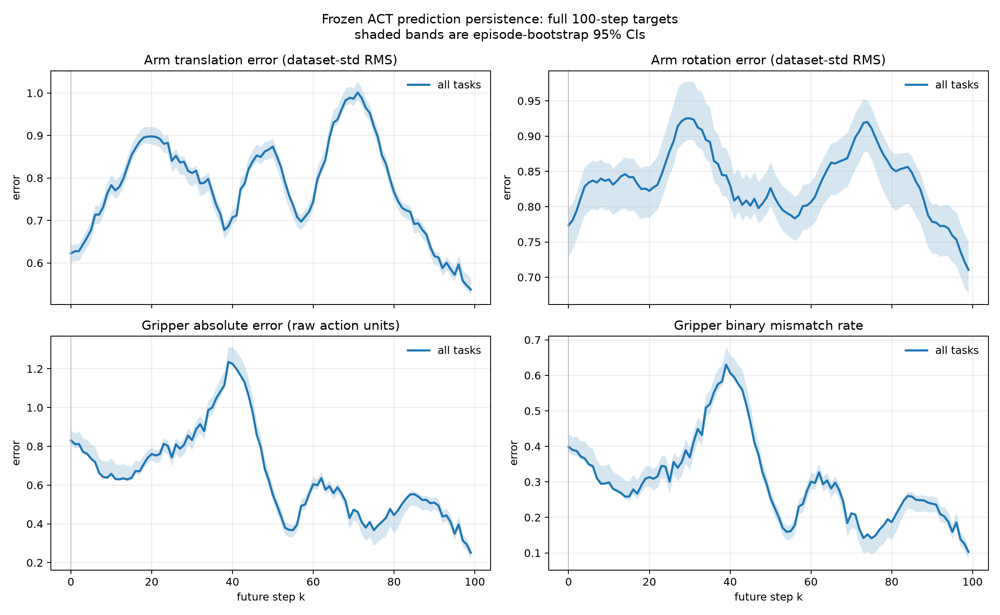
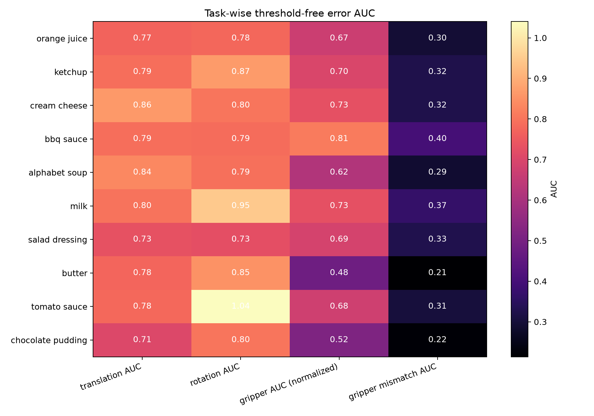
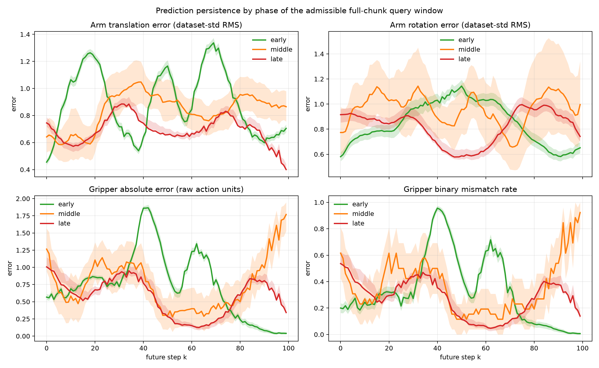

# Gate-1: Group-wise prediction persistence audit

**Status: offline frozen-policy audit complete.**

This is a read-only, teacher-forced analysis of the frozen ACT policy on the
exact LIBERO Object demonstrations used for checkpoint training. It does not
implement or evaluate a dynamic horizon, scheduler, rollout, simulator, or
robot experiment. No training was performed.

## 1. Provenance and inputs

| Item | Result |
|---|---|
| Starting commit | `9e466176b08802b3613ca6b640af2dbe36c55ca2` |
| Ending commit | The final audit commit is reported in the handoff; this report is committed with the artifacts below. |
| Checkpoint | `/home/thor/projects/checkpoints/zeromidnight_act_libero_object` |
| Checkpoint provenance | `DorayakiLin/libero_object_25_08_23_lerobotv2.1` |
| Dataset | `/home/thor/datasets/libero_object_25_08_23_lerobotv2.1` |
| Dataset revision | `cbf7122bbdbaa0c50517a6a4b2ae663d0e96e51a` |
| Dataset format | LeRobot v2.1 metadata, Parquet trajectories, MP4 videos |
| Episodes / frames / tasks | `454 / 66,984 / 10` |
| Action / state dimensions | `7 / 8` |
| ACT chunk size | `100`; temporal ensembling disabled |

The dataset was acquired before this analysis with the exact command:

```text
/home/thor/projects/upstreams/lerobot-env/bin/hf download \
  DorayakiLin/libero_object_25_08_23_lerobotv2.1 \
  --repo-type dataset \
  --local-dir /home/thor/datasets/libero_object_25_08_23_lerobotv2.1
```

It was stored outside the repository. The local payload is 541,468,353 bytes
(516.384 MiB, excluding the downloader cache); the remote manifest and local
manifest matched exactly at 1,367 files. Verification found 454 Parquet
episode files and 454 non-empty videos in each of the agent and wrist camera
streams. The checkpoint config reports state input size 8, action output size
7, and chunk size 100, matching the dataset and the audit.

The action contract is:

- `action[0:3]`: relative translation;
- `action[3:6]`: relative axis-angle rotation;
- `action[6]`: gripper command;
- arm group: `action[0:6]`; gripper group: `action[6]`.

Translation and rotation were never combined into a physical-unit norm.

## 2. Deterministic sampling and inference protocol

All 454 episodes were processed in ascending episode index. For an episode of
length `L`, only starts with a complete 100-step target were eligible. Starts
were:

```text
0, 50, 100, ... <= L-100, plus L-100 when not already present
```

This is deterministic, has no random seed, limits regular-sample overlap to
50 frames, and includes the final valid window. It produced 1,098 observation
points: 2--5 per episode, mean 2.419 points per episode. The point counts by
task were:

| Task | Episodes | Observation points |
|---|---:|---:|
| alphabet soup | 44 | 118 |
| bbq sauce | 46 | 108 |
| butter | 45 | 125 |
| chocolate pudding | 50 | 142 |
| cream cheese | 45 | 101 |
| ketchup | 45 | 112 |
| milk | 45 | 97 |
| orange juice | 45 | 100 |
| salad dressing | 47 | 99 |
| tomato sauce | 42 | 96 |

At each point, the checkpoint-compatible preprocessing was applied to the
stored state and both stored camera frames. The policy was queried once with
`predict_action_chunk`; the resulting `(100, 7)` action chunk was compared
with the demonstrated actions at offsets `k=0..99`. In total, 1,098 frozen
inferences and 109,800 predicted action steps were evaluated. The script reads
Parquet and video files directly and does not instantiate or step LIBERO.

## 3. Metrics

The checkpoint's saved action normalizer was used without refitting. Its
statistics have count 66,984 and standard deviations:

```text
[0.268119, 0.438444, 0.447512, 0.024448, 0.049362, 0.042103, 0.997446]
```

Arm metrics are separate channelwise dataset-standard-deviation RMS values:

```text
translation = sqrt(mean((prediction-target)^2 / std[0:3]^2))
rotation    = sqrt(mean((prediction-target)^2 / std[3:6]^2))
```

For the gripper, raw absolute error, absolute error divided by `std[6]`, and
binary mismatch rate were reported. For the binary metric, demonstrated
gripper targets were thresholded to `{-1,+1}` at zero and predicted values
were thresholded at zero. The primary comparison is threshold-free: curve AUC
(mean over `k=0..99`), linear slope, last-ten-minus-first-ten change, and the
fraction of positive adjacent curve differences. Uncertainty bands are
episode-level bootstrap 95% intervals from 2,000 draws with seed `20260820`.

For an auxiliary persistence-length statistic, thresholds were declared before
inspection: 1.0 for normalized translation, normalized rotation, and
normalized gripper absolute error; 0.5 for gripper mismatch. The reported
crossing is the first aggregate-curve crossing only. Because the curves are
nonmonotonic, this crossing is not interpreted as a reliable persistence
horizon.

## 4. Main prediction curves



The main plot is also available as
[prediction_error_curves.png](/home/thor/projects/one-clock/experiments/group_prediction_persistence/prediction_error_curves.png).

Overall threshold-free results:

| Metric | AUC | Linear slope / step | Last10 - first10 | Fixed crossing |
|---|---:|---:|---:|---:|
| arm translation, normalized RMS | 0.783 | -0.000700 | -0.097 | `k=71` at 1.0 |
| arm rotation, normalized RMS | 0.836 | -0.000341 | -0.062 | none at 1.0 |
| gripper absolute error, raw | 0.652 | -0.004761 | -0.349 | n/a |
| gripper absolute error, normalized | 0.653 | -0.004773 | -0.349 | `k=35` at 1.0 |
| gripper binary mismatch | 0.302 | -0.002191 | -0.172 | `k=34` at 0.5 |

The bootstrap 95% intervals for the AUCs were `[0.774, 0.791]` for arm
translation, `[0.814, 0.854]` for arm rotation, `[0.641, 0.670]` for
normalized gripper absolute error, and `[0.295, 0.313]` for gripper mismatch.
The aggregate curves are oscillatory and generally decline over the horizon;
they do not show the hypothesized monotonic error growth with future step.
The fixed crossings therefore should not be read as “the policy loses
persistence at k”; they only document the predeclared curve statistic.

The group profiles are nevertheless different: gripper error has a larger
negative end-to-end change and pronounced excursions, while arm translation
and rotation remain at different, higher normalized error levels with their
own oscillations. This is a difference in temporal error structure, not yet a
consistent ordering of temporal reliability loss.

## 5. Task variation



The task heatmap is also available as
[task_error_auc_heatmap.png](/home/thor/projects/one-clock/experiments/group_prediction_persistence/task_error_auc_heatmap.png).

Task variation is substantial. Across the ten tasks, threshold-free AUC
ranges were:

- arm translation: `0.707` (chocolate pudding) to `0.864` (cream cheese);
- arm rotation: `0.726` (salad dressing) to `1.040` (tomato sauce);
- normalized gripper absolute error: `0.483` (butter) to `0.813` (BBQ sauce);
- gripper mismatch: `0.214` (butter) to `0.400` (BBQ sauce).

The sign of the task-wise linear slope was not uniform for arm metrics: 4/10
translation slopes and 5/10 rotation slopes were positive. Gripper normalized
absolute-error slopes were negative for all 10 tasks; mismatch slopes were
negative for 9/10 tasks. These task-wise results support task dependence, but
they do not establish one universal arm-versus-gripper persistence ordering.

## 6. Episode phase analysis



The phase plot is also available as
[query_window_phase_curves.png](/home/thor/projects/one-clock/experiments/group_prediction_persistence/query_window_phase_curves.png).

Two phase definitions were kept separate:

1. **Query-window phase:** thirds of the admissible start range
   `frame_index/(L-100)`. This yields early/middle/late curves for the
   available full-chunk query positions.
2. **Episode phase:** thirds of the physical episode
   `frame_index/(L-1)`. Because every target must contain 100 future frames,
   no sampled full target fell in the late third; it has 0 points and 0
   episodes. The middle third has 217 points from 198 episodes, and the early
   third has 881 points from all 454 episodes.

The query-window phase result is informative but sparse in the middle: early
has 455 points from 454 episodes, middle has only 26 points from 26 episodes,
and late has 617 points from all 454 episodes. Early and late query windows
show declining aggregate curves, whereas the sparse middle subset has positive
end-to-end changes for translation and gripper error. This indicates phase or
window-position dependence is plausible, but the middle estimate is too sparse
for a strong conclusion. A genuine late-episode analysis requires shorter
targets, truncated targets, or another predeclared protocol.

## 7. Scientific answers

**Q1 — Does error grow with `k`?** Not in the aggregate full-chunk audit.
All five reported aggregate linear slopes are negative, and the error curves
are nonmonotonic. The data do not support treating future-step error as a
simple increasing decay curve.

**Q2 — Do arm and gripper decay at different rates?** Their curves and
threshold-free summaries differ, so the frozen policy has group-dependent
temporal error structure. However, the observed direction is not the desired
“one group loses reliability earlier” pattern: both groups generally decline in
the aggregate, and the gripper's negative slope is larger in magnitude. Since
the curves have peaks and reversals, a single slope does not define temporal
persistence.

**Q3 — Is there a consistent ordering across tasks?** No. Task AUCs vary
strongly, arm slopes change sign across tasks, and phase subsets change the
curve shape. A universal arm-less-persistent-than-gripper or
gripper-less-persistent-than-arm ordering was not found.

**Q4 — Does this explain the static horizon result offline?** Only partially.
The audit shows group- and task-dependent prediction profiles, which is
compatible with the static group-horizon observation. It does not provide a
monotonic, consistent persistence signal that would justify changing horizons
within an episode.

**Gate-1 classification: mixed evidence (outcome C).** Group-wise temporal
error structure exists, but simple prediction persistence as monotonic future
error growth is weak or absent, and the ordering is task/phase dependent.
Dynamic horizon is not proven and is not implemented by this work.

## 8. Implications for dynamic horizon design

No design is selected yet. If the project proceeds, the next method study
should first target a phase- and task-aware signal rather than directly map
these aggregate curves to a scheduler. Candidate directions are:

1. **Training-free:** derive group horizons from a predeclared online estimate
   of prediction persistence;
2. **Self-supervised:** learn a persistence estimator from frozen-policy
   prediction/target pairs;
3. **Uncertainty-based:** use predictive confidence as a commitment-duration
   signal.

These are future design options only. This audit did not implement or select a
dynamic horizon method.

## 9. Artifacts and limitations

Analysis artifacts are in
[`experiments/group_prediction_persistence/`](/home/thor/projects/one-clock/experiments/group_prediction_persistence/):

- `audit.py`: deterministic offline data loading, frozen inference, metrics,
  bootstrap summaries, and plots;
- `summary.json`: complete numerical results and provenance;
- `prediction_error_curves.png`: all-task curves;
- `task_error_auc_heatmap.png`: task-wise AUCs;
- `query_window_phase_curves.png`: admissible-query-window phase curves;
- `predictions.npz`: sampled predicted/true chunks and sample indices.

Limitations:

- Demonstration data have no success labels, so success-conditioned phase
  analysis was not possible.
- Full 100-step targets censor the late physical episode phase and leave the
  query-window middle phase sparse.
- This is teacher-forced offline comparison to demonstrations, not closed-loop
  rollout performance.
- The sampled observations are deterministic but not every frame; the final
  valid window can overlap a regular sample by more than the regular 50-frame
  interval.
- Dataset-standard-deviation normalization is a statistical comparison, not a
  physical translation/rotation metric.
- The audit measures errors of a single frozen checkpoint on one exact dataset;
  it does not establish generalization or causality for the static horizon
  results.

Final validation must confirm that only this report and the analysis artifact
directory are changed in git. Datasets, checkpoints, videos, paper files,
executor files, and rollout code remain outside the committed changes.
