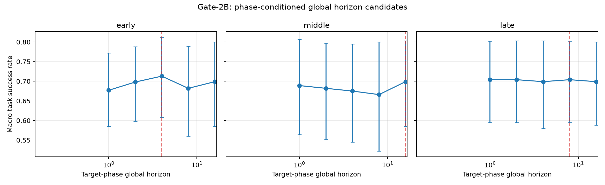
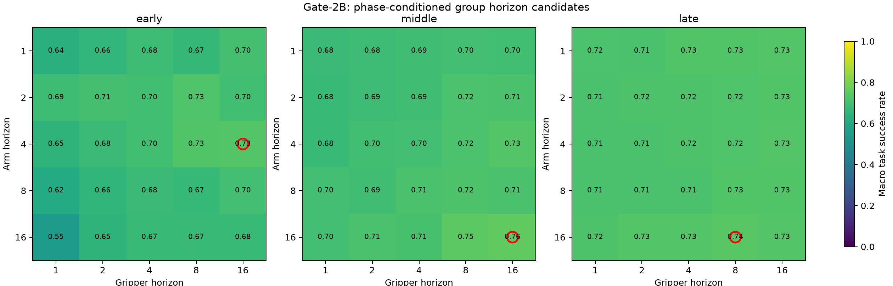
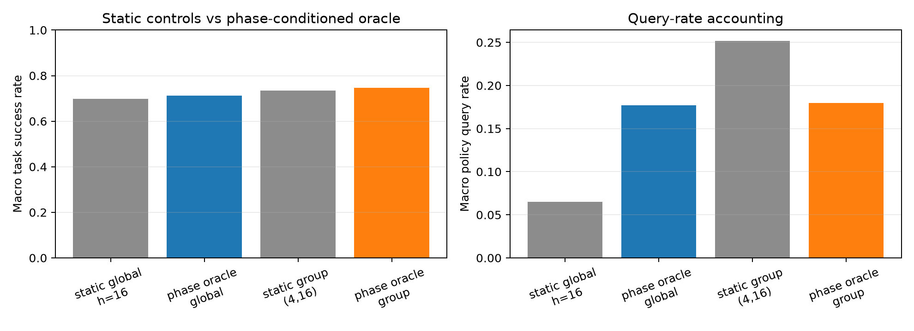

# Gate-2B: Phase-conditioned oracle horizon analysis

**Status: complete offline analysis.** This report evaluates a retrospective phase-conditioned oracle horizon. It does not implement a scheduler, dynamic horizon controller, executor behavior, rollout code, or paper changes.

## 1. Research question

Does the empirical optimal execution horizon for the same action group depend on normalized task phase? The result is called a **phase-conditioned oracle horizon**, not a ground-truth horizon.

## 2. Provenance and protocol

| Item | Value |
|---|---|
| Starting commit | `ba20d60adf8d5f03f1b1d3615266f81b788805c7` |
| Ending commit | `recorded in final handoff` |
| Checkpoint | `/home/thor/projects/checkpoints/zeromidnight_act_libero_object` |
| Dataset | `/home/thor/datasets/libero_object_25_08_23_lerobotv2.1` |
| Tasks | 10 LIBERO Object tasks |
| Rollout episodes | 230 (task 0: 50; tasks 1–9: 20 each) |
| Seed rule | `seed = 1000 + init_state_id` |

The frozen ACT policy was evaluated in the existing LIBERO Object runtime setup. The established state IDs and seeds were preserved. Each candidate was evaluated as a fresh closed-loop rollout; no training was performed.

Phase is the deterministic rollout-time proxy `environment_step / env._max_episode_steps`: early `< 1/3`, middle `[1/3, 2/3)`, and late `>= 2/3`. A phase horizon is applied only when the next group commitment expires; no query is forced at a phase boundary, so an existing commitment may cross a boundary.

The primary groups are arm=`action[0:6]` and gripper=`action[6]`. Global candidates use horizons `{1,2,4,8,16}`. Group candidates use all 25 arm/gripper combinations from that set. For each target phase, the other phases use the fixed controls global `h=16` or group `(4,16)`.

## 3. Metrics and uncertainty

Reported metrics are success rate, environment steps, frozen-policy query count, and query rate (queries/environment steps). Selection uses the macro mean of per-task success rates, with deterministic query-rate and horizon tie-breaks. Pooled success is also retained. Per-task success intervals are Wilson 95% intervals; macro uncertainty uses a 20,000-draw task bootstrap with seed `20260819`.

## 4. Phase × global horizon

| Phase | Selected global h | Macro success | 95% bootstrap CI | Mean env steps | Mean policy queries | Macro query rate |
|---|---:|---:|---|---:|---:|---:|
| early | 4 | 0.713 | [0.608, 0.812] | 178.4 | 29.6 | 0.169 |
| middle | 16 | 0.699 | [0.585, 0.803] | 178.5 | 11.6 | 0.065 |
| late | 8 | 0.704 | [0.595, 0.801] | 178.4 | 13.1 | 0.073 |

## 5. Phase × group horizon

| Phase | Arm h | Gripper h | Macro success | 95% bootstrap CI | Mean env steps | Mean policy queries | Macro query rate |
|---|---:|---:|---:|---|---:|---:|---:|
| early | 4 | 16 | 0.734 | [0.615, 0.844] | 176.9 | 44.5 | 0.252 |
| middle | 16 | 16 | 0.757 | [0.660, 0.852] | 173.9 | 33.8 | 0.196 |
| late | 16 | 8 | 0.739 | [0.620, 0.850] | 176.9 | 42.7 | 0.242 |

## 6. Static controls versus combined phase oracle

The combined oracle uses the selected map for all three phases. This is an offline selection/evaluation comparison, not evidence that a deployable dynamic controller improves performance.

| Configuration | Macro success | Mean env steps | Mean policy queries | Macro query rate |
|---|---:|---:|---:|---:|
| Static global h=16 | 0.699 | not logged in baseline | not logged in baseline | 0.065 |
| Phase oracle global | 0.713 | 178.3 | 31.1 | 0.177 |
| Static group (4,16) | 0.734 | not logged in baseline | not logged in baseline | 0.252 |
| Phase oracle group | 0.747 | 174.0 | 30.7 | 0.180 |

Paired task-bootstrap difference, phase-global minus static-global: `+0.014` [-0.045, +0.069].

Paired task-bootstrap difference, phase-group minus static-group: `+0.013` [-0.017, +0.045].

## 7. Answers to the research questions

**Does the empirical optimal horizon depend on task phase?** At the selected point estimates, **yes**: global selections are `[4, 16, 8]`, group arm selections are `[4, 16, 16]`, and group gripper selections are `[16, 16, 8]` for early/middle/late.

**Does the same group select different horizons?** Yes for arm and yes for gripper under the selected point estimates. This is the requested empirical phase-dependence test; it should be read with the task-bootstrap intervals and selection limitations below.

**Is this dynamic horizon improvement?** No claim is made. The combined phase oracle is retrospective and selected from the same task set used for evaluation. It only tests whether phase-conditioned horizon motivation is present.

## 8. Implications for dynamic horizon design

If phase-conditioned persistence is retained as a research direction, the next method study could compare: (1) a training-free estimator derived from prediction persistence, (2) a self-supervised persistence estimator, and (3) an uncertainty/confidence-based signal. This audit does not choose among them and does not implement any scheduler.

## 9. Limitations

- Normalized episode time is a rollout proxy, not a semantic task-phase label.
- Oracle maps use phase information retrospectively and are selected/evaluated on the same tasks; held-out selection is still needed.
- No query is forced at phase boundaries; phase exposure depends on episode termination and commitment alignment.
- The task bootstrap treats the ten tasks as the resampling units; it does not remove within-task state correlation.
- The result is specific to this frozen checkpoint, LIBERO Object tasks, action representation, and candidate grid.
- Environment steps and query rates are accounting metrics, not a claim of real-robot efficiency.

## 10. Artifacts

- `experiments/phase_conditioned_oracle/phase_oracle.py` — frozen-policy oracle evaluator.
- `experiments/phase_conditioned_oracle/merge_phase_parts.py` and `merge_combined_parts.py` — deterministic partition merges.
- `experiments/phase_conditioned_oracle/summary.json` — full candidate/task aggregates and comparisons.
- `experiments/phase_conditioned_oracle/phase_global_success.png` — global candidate curves.
- `experiments/phase_conditioned_oracle/phase_group_success_heatmaps.png` — group candidate heatmaps.
- `experiments/phase_conditioned_oracle/phase_oracle_vs_static.png` — controls and query-rate comparison.
