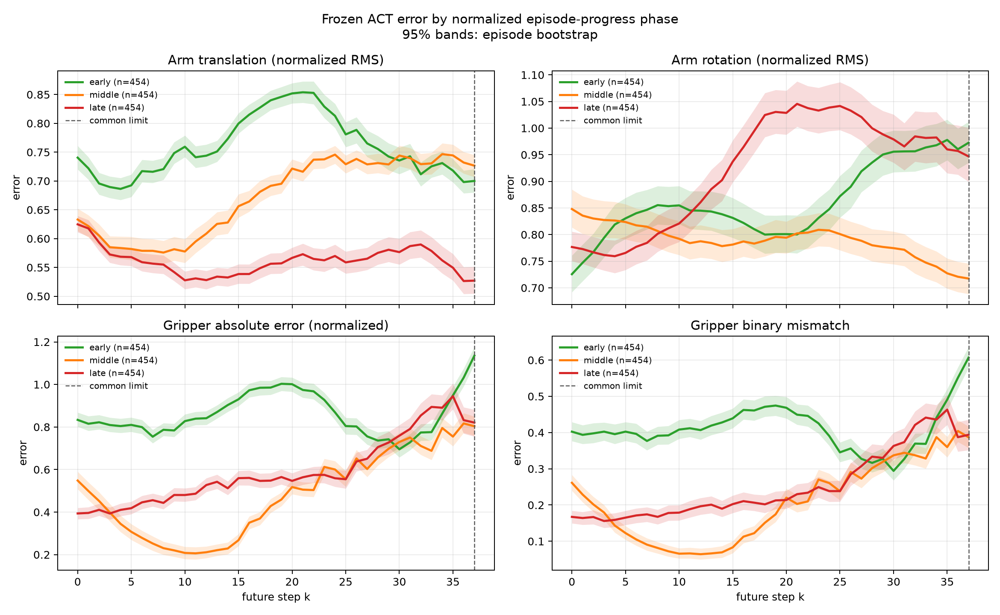
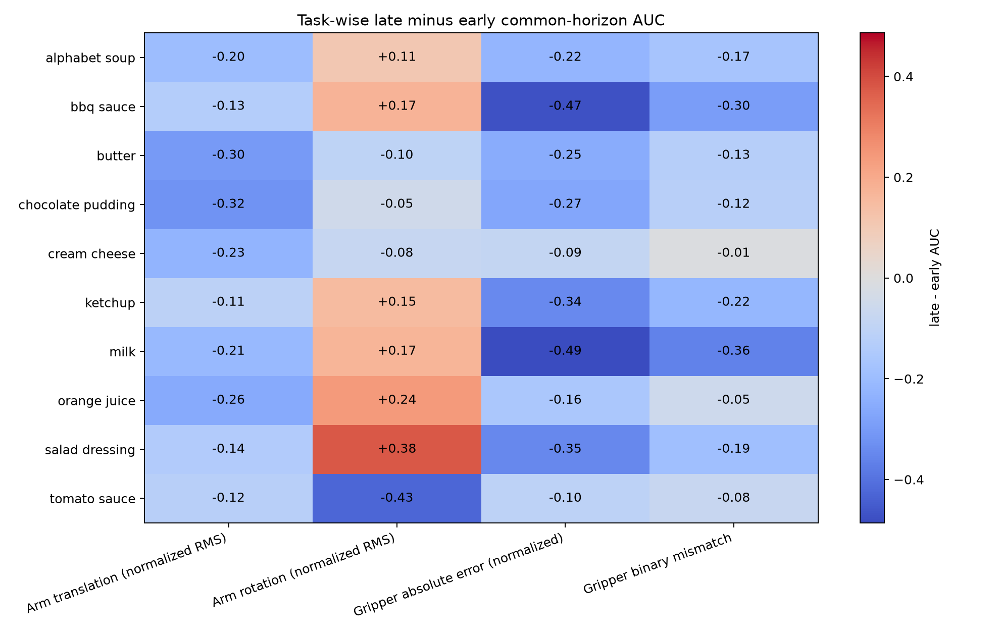

# Gate-2A: Phase-conditioned group-wise temporal persistence analysis

**Status: offline phase-conditioned audit complete.**

This analysis tests whether the same action group has different temporal
predictability at different normalized phases of a LIBERO demonstration. It is
read-only. It does not implement dynamic horizon control, a scheduler, a
rollout, or executor changes, and it does not modify paper files.

## 1. Hypothesis and provenance

The tested hypothesis is:

```text
P_g(k | early) != P_g(k | middle) != P_g(k | late)
```

for at least one action group `g`, where phase is normalized episode progress.
This is a phase-conditioned hypothesis; it does not assume that arm always
expires before gripper.

| Item | Result |
|---|---|
| Starting commit | `e2753776c26040e05438b3b93267db229665fcdb` |
| Ending commit | The final Gate-2A commit is reported in the handoff. |
| Checkpoint | `/home/thor/projects/checkpoints/zeromidnight_act_libero_object` |
| Dataset | `/home/thor/datasets/libero_object_25_08_23_lerobotv2.1` |
| Dataset source | `DorayakiLin/libero_object_25_08_23_lerobotv2.1` |
| Dataset revision | `cbf7122bbdbaa0c50517a6a4b2ae663d0e96e51a` |
| Dataset size | 454 episodes, 66,984 frames, 10 tasks |
| Action/state dimensions | 7-D / 8-D |
| ACT chunk | 100 actions; temporal ensembling disabled |

The checkpoint-compatible ACT preprocessing and inference path from Gate-1 was
used. The model was frozen and no training was performed.

## 2. Sampling and phase definition

The previous Gate-1 full-chunk sampling could not identify the late third:
episodes are 114--254 frames long, so a full 100-step demonstrated target
censors late observations. Gate-2A therefore used a predeclared,
phase-stratified sampling protocol:

- all 454 episodes, in ascending episode index;
- fixed starts every 25 frames: `0, 25, 50, ...`;
- additionally include `ceil(L/3)` and `ceil(2L/3)` for each episode of
  length `L`;
- no final one-frame sample was added;
- every sampled point has at least one demonstrated future action.

This produced 3,740 observation points, 6--13 per episode, with a mean of
8.238. The phase point counts were 1,091 early, 1,335 middle, and 1,314 late;
each phase includes all 454 episodes. The task point counts were:

| Task | Episodes | Points |
|---|---:|---:|
| alphabet soup | 44 | 376 |
| bbq sauce | 46 | 379 |
| butter | 45 | 389 |
| chocolate pudding | 50 | 427 |
| cream cheese | 45 | 365 |
| ketchup | 45 | 375 |
| milk | 45 | 361 |
| orange juice | 45 | 362 |
| salad dressing | 47 | 361 |
| tomato sauce | 42 | 345 |

At every point the frozen policy predicted a full `(100, 7)` action chunk. The
demonstrated target is right-censored at the episode boundary. To compare
phases without giving early samples a longer evaluation range, all primary
phase statistics use the predeclared common range `k=0..37`. This is the
shortest demonstrated suffix available at the explicit late boundary across
episodes. The full model output is still generated, but actions beyond the
available demonstrated suffix are not scored.

## 3. Metrics and uncertainty

The action groups and metrics remain consistent with Gate-1:

- arm translation: `action[0:3]`, normalized channelwise RMS using the
  checkpoint action standard deviations;
- arm rotation: `action[3:6]`, separately normalized channelwise RMS;
- gripper: `action[6]`, normalized absolute error using `std[6]` and binary
  mismatch after zero thresholding.

Translation and rotation were not combined into a physical metric. The
checkpoint action standard deviations were used without refitting:

```text
[0.268119, 0.438444, 0.447512, 0.024448, 0.049362, 0.042103, 0.997446]
```

For each phase, curves are episode-balanced: each episode first contributes
its mean error over its sampled points, then episodes are averaged. Confidence
intervals are episode bootstrap 95% intervals with 2,000 draws and seed
`20260820`. Effect sizes are paired Cohen's d on per-episode common-horizon
AUC differences. A positive `early - late` difference means early has higher
error and late is more predictable.

## 4. Phase-conditioned results



The main plot is also available as
[phase_error_curves.png](/home/thor/projects/one-clock/experiments/phase_conditioned_persistence/phase_error_curves.png).

| Metric | Early AUC | Middle AUC | Late AUC | Early - late AUC | 95% CI | Paired d |
|---|---:|---:|---:|---:|---:|---:|
| arm translation normalized RMS | 0.760 | 0.672 | 0.561 | +0.199 | [+0.184, +0.214] | +1.21 |
| arm rotation normalized RMS | 0.862 | 0.790 | 0.924 | -0.062 | [-0.102, -0.026] | -0.15 |
| gripper normalized absolute error | 0.857 | 0.480 | 0.590 | +0.267 | [+0.237, +0.298] | +0.80 |
| gripper binary mismatch | 0.409 | 0.206 | 0.252 | +0.157 | [+0.134, +0.181] | +0.64 |

The phase effects are not simply monotonic:

- translation error declines from early to middle to late;
- rotation is lowest in the middle and highest late;
- gripper absolute error and mismatch are lowest in the middle, with late
  better than early but worse than middle.

Therefore, the result is phase dependence of the same group's error profile,
not evidence for a universal “late means shorter horizon” rule. The strongest
effects are for translation and gripper. Rotation changes direction across
phases and has a small early-versus-late standardized effect.

## 5. Task consistency



The task heatmap is also available as
[task_phase_effect_heatmap.png](/home/thor/projects/one-clock/experiments/phase_conditioned_persistence/task_phase_effect_heatmap.png).

The task-wise late-minus-early AUC ranges were:

| Metric | Range across tasks | Tasks with late > early error |
|---|---:|---:|
| arm translation | `-0.322` to `-0.106` | 0 / 10 |
| arm rotation | `-0.426` to `+0.377` | 6 / 10 |
| gripper normalized absolute error | `-0.486` to `-0.087` | 0 / 10 |
| gripper mismatch | `-0.364` to `-0.009` | 0 / 10 |

Translation and both gripper measures show the same late-versus-early
direction in all ten tasks, although the magnitude varies. Rotation is
task-dependent: six tasks have higher late error and four have lower late
error. Thus phase effects are consistent for translation/gripper at this
coarse level, but not for every action subgroup.

## 6. Answers to the research questions

**Q1 — Does the same group have phase-dependent persistence?** Yes for arm
translation and gripper under this offline metric: early-versus-late AUC
effects are large, with paired `d=1.21` and `d=0.80`. Gripper curves are
nonmonotonic, so a phase-conditioned estimator is more appropriate than a
single expiration step. Arm rotation shows weaker and directionally different
phase behavior (`d=-0.15`).

**Q2 — Are phase effects stronger than group effects?** A formal pooled answer
is not appropriate because translation, rotation, gripper absolute error, and
mismatch are different statistics and units. Descriptively, phase effects are
large for translation and gripper and are at least as important as the
aggregate group-profile differences observed in Gate-1. Group identity alone
does not explain the observed error profile; phase/context is a material
additional factor. Rotation remains an exception.

**Q3 — Are differences consistent across tasks?** For translation and gripper,
the late-versus-early direction is consistent across all ten tasks. Rotation
is not consistent, so the phase effect is task-dependent for that subgroup.
Task-level magnitudes vary substantially even where the sign agrees.

**Q4 — Does this support `h_g(t)` instead of `h_g`?** It provides offline
scientific motivation for studying a phase-conditioned horizon for translation
and gripper. It does not validate a scheduler or imply that a fixed phase
mapping will work in closed loop. A future method should allow nonmonotonic and
task-dependent phase behavior, especially for rotation.

## 7. Scientific classification

**Gate-2A outcome: strong phase dependence for translation and gripper, mixed
across the complete arm group.** This supports proceeding to a targeted
phase-conditioned dynamic-horizon method study, but dynamic horizon itself is
not demonstrated by this audit.

The result should not be interpreted as “dynamic horizon works.” It only shows
that the frozen policy's offline prediction error depends materially on
normalized episode phase for some action groups.

## 8. Implications for dynamic horizon design

The next research step should be a training-free, phase-conditioned persistence
signal with explicit safeguards:

1. estimate group-specific persistence from recent prediction error or an
   uncertainty proxy;
2. condition on normalized phase only when that phase estimate is reliable;
3. retain task/context conditioning because rotation is not consistent across
   tasks;
4. control for action variance and command regime, since lower error can also
   reflect smoother or less variable demonstrated actions rather than stronger
   model persistence;
5. validate the signal offline on held-out episodes before any scheduler or
   rollout implementation is considered.

No scheduler, horizon rule, executor change, or dynamic-horizon code was
implemented here.

## 9. Artifacts and limitations

Artifacts are in
[`experiments/phase_conditioned_persistence/`](/home/thor/projects/one-clock/experiments/phase_conditioned_persistence/):

- `phase_audit.py`: deterministic sampling, frozen inference, metrics,
  episode bootstrap, effect sizes, and plots;
- `summary.json`: numerical results and provenance;
- `phase_error_curves.png`: phase-conditioned curves with episode-bootstrap
  intervals;
- `task_phase_effect_heatmap.png`: task-wise late-minus-early AUC;
- `phase_effect_sizes.png`: paired Cohen's d by metric and phase contrast.

Limitations:

- `t / episode_length` is a temporal proxy, not a semantic task-progress
  label. Different LIBERO tasks can reach manipulation subgoals at different
  normalized times.
- Late observations have shorter demonstrated suffixes. The common `k=0..37`
  analysis prevents unequal maximum horizons from driving the primary phase
  comparison, but it limits the tested persistence range.
- The fixed-interval plus boundary sampling is deterministic but not every
  frame, and samples within a phase are not independent. Confidence intervals
  bootstrap episodes, not individual windows.
- The demonstrations have no success labels, so success-conditioned phase
  analysis was not possible.
- This is teacher-forced offline comparison, not closed-loop rollout
  performance.
- The audit covers one frozen checkpoint and one exact dataset; it does not
  establish generalization or causality for static horizon results.

Final validation must confirm that only this report and the new analysis
directory are committed. Paper files, executor files, rollout code, datasets,
checkpoints, and videos remain outside the change set.
