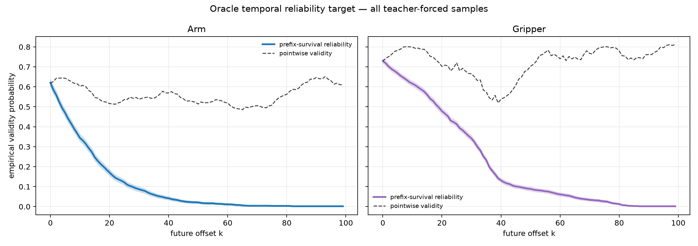
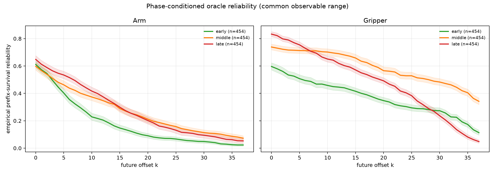
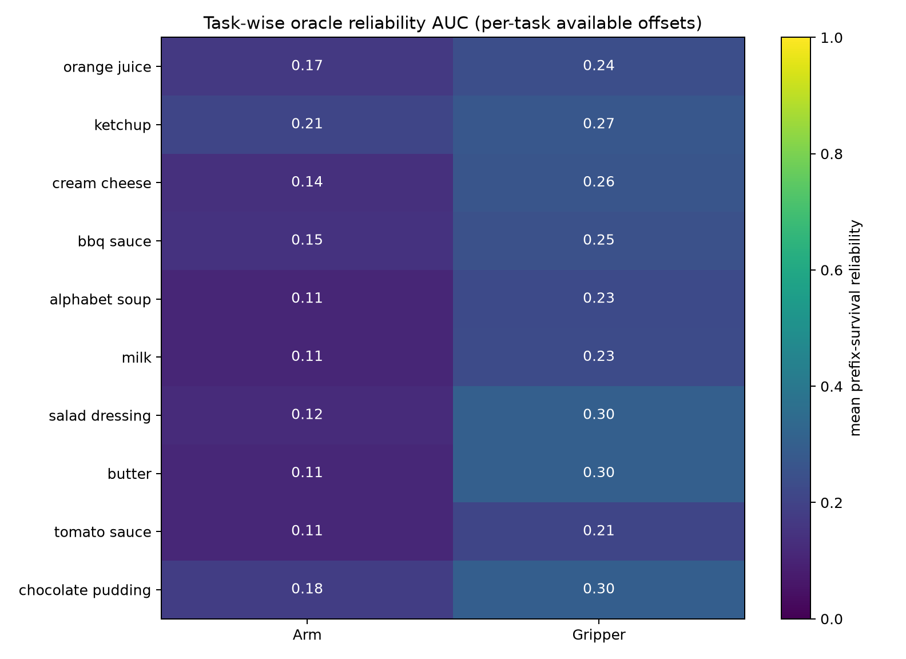

# Temporal Reliability Estimation: Stage-0 target audit

**Status:** offline target construction and analysis complete.  This work uses
the frozen ACT policy on teacher-forced LIBERO Object demonstrations only.  No
reliability model, scheduler, executor, rollout, checkpoint, or paper file was
modified.

## 1. Problem formulation

The goal is to support a future adaptive group commitment horizon
\(h_g(t)\), but demonstrations provide no direct label for a correct horizon.
We therefore do **not** train an `observation -> horizon` mapping.  Instead,
this stage constructs a group-wise **oracle reliability target** (also called a
self-supervised temporal-validity target) for an action chunk predicted now.

For a frozen policy prediction

\[
\widehat A_t=\pi_\theta(o_t),\qquad
\widehat A_t=[\widehat a_{t,0},\ldots,\widehat a_{t,99}],
\]

and action group \(g\in\{\mathrm{arm},\mathrm{gripper}\}\), a pointwise
validity event \(V_g(t,k)\) is measured against the demonstrated future action
at offset \(k\).  The target used for a future learned reliability head is the
prefix survival event

\[
Y_g(t,k)=\prod_{j=0}^{k} V_g(t,j).
\]

Thus \(Y_g(t,k)=1\) means every action in the group-specific predicted prefix
through \(k\) agrees with this explicit demonstration-consistency proxy.  It
is neither a ground-truth horizon, a task-success probability, nor a
closed-loop safety guarantee.

## 2. Target definition and construction protocol

The dataset was constructed with checkpoint
`/home/thor/projects/checkpoints/zeromidnight_act_libero_object` and dataset
`/home/thor/datasets/libero_object_25_08_23_lerobotv2.1`.  The policy is frozen,
uses its non-ensembled 100-action chunk output, and is queried once per sampled
observation.  LIBERO is never instantiated or stepped.

The labels are deliberately group appropriate:

- **Arm (`action[0:6]`):** `V_arm=1` iff normalized translation RMS on
  `action[0:3]` is at most 1.0 **and** normalized rotation RMS on `action[3:6]`
  is at most 1.0.  Translation and rotation are not merged into an arbitrary
  six-dimensional physical-unit norm.
- **Gripper (`action[6]`):** `V_gripper=1` iff normalized absolute error is at
  most 1.0 **and** the zero-thresholded predicted command has the same sign as
  the demonstration.

The tolerances were inherited from the earlier audit's predeclared normalized
scale.  Demonstration suffixes are right-censored at the episode end; offsets
beyond that end are masked rather than marked invalid.  Starts are every 25
frames plus `ceil(L/3)` and `ceil(2L/3)`, so early, middle, and late normalized
episode phases are represented.

The construction output is [reliability_dataset.npz](experiments/temporal_reliability/reliability_dataset.npz), with predicted chunks, pointwise labels,
prefix-survival labels, errors, censoring masks, and compact metadata.  The
process is reproducible from
[construct_dataset.py](experiments/temporal_reliability/construct_dataset.py);
[analyze_reliability.py](experiments/temporal_reliability/analyze_reliability.py)
creates the summaries and figures.

## 3. Dataset statistics

| Quantity | Value |
|---|---:|
| Demonstration episodes / tasks | 454 / 10 |
| Observation/chunk samples | 3,740 |
| Frozen predicted actions | 374,000 |
| Observed prediction–demonstration pairs after censoring | 259,279 |
| Samples per episode | 6–13 (mean 8.24) |
| Phase samples (early / middle / late) | 1,091 / 1,335 / 1,314 |
| Arm pointwise-valid fraction | 0.560 |
| Gripper pointwise-valid fraction | 0.719 |
| Arm prefix-survival-valid fraction | 0.131 |
| Gripper prefix-survival-valid fraction | 0.294 |

The initial pointwise events are not degenerate: 2,314/3,740 arm samples and
2,724/3,740 gripper samples are valid at \(k=0\).  Prefix survival becomes
sparse at long offsets, as intended: an early invalidation keeps later
survival labels at zero.

## 4. Reliability curves and checks

Empirical survival curves use an episode-balanced discrete Kaplan–Meier
estimate.  This is important: a naive average over the right-censored labels
can rise when its set of observed samples changes with offset.  The product
limit estimate retains censored samples in the risk set until censoring and is
nonincreasing whenever the target is correctly formed.

| Group | Reliability at \(k=0\) | Mean reliability AUC | 95% episode-bootstrap CI | Reliability at \(k=99\) |
|---|---:|---:|---:|---:|
| Arm | 0.621 | 0.098 | [0.093, 0.126] | 0.0018 |
| Gripper | 0.730 | 0.214 | [0.209, 0.241] | 0.0017 |

The survival curves are smooth at this aggregate scale: mean absolute adjacent
changes are 0.0063 (arm) and 0.0074 (gripper), with maxima 0.035 and 0.034.
They have zero increasing adjacent differences under the censor-aware survival
estimator.  That monotonicity is a property of the *prefix* target, not an
assumption that future actions become pointwise worse.

Indeed, the raw pointwise validity curves are nonmonotonic: arm has 46 positive
and 53 negative adjacent changes; gripper has 55 positive and 44 negative
changes.  Therefore this audit **does not support** assuming that a larger
offset always has lower pointwise demonstration consistency.  The survival
target is useful precisely because it encodes retained-prefix validity without
making that false pointwise assumption.

### Phase comparison

All phases have all 454 episodes.  The comparison uses the common observable
range \(k=0\ldots37\).

| Group | Early AUC | Middle AUC | Late AUC |
|---|---:|---:|---:|
| Arm | 0.177 [0.162, 0.192] | 0.267 [0.247, 0.288] | 0.275 [0.257, 0.295] |
| Gripper | 0.369 [0.349, 0.389] | 0.591 [0.571, 0.613] | 0.481 [0.466, 0.497] |

Phase matters, especially for gripper reliability: middle is highest, late is
intermediate, and early is lowest over the common range.  Arm reliability is
higher in middle/late than early.  This is phase dependence under a teacher-
forced proxy, not a causal rule for an online phase scheduler.

### Task comparison

Task-specific mean reliability AUC varies from 0.107 to 0.208 for arm and
0.209 to 0.304 for gripper.  Ketchup is the highest arm-AUC task (0.208),
while salad dressing is the highest gripper-AUC task (0.304); tomato sauce is
lowest for gripper (0.209).  Group differences are present but should not be
interpreted as a universal arm-versus-gripper horizon ordering.

### Calibration and threshold sensitivity

Calibration of a reliability **estimator** is not measurable yet because no
probability model was trained.  This audit reports empirical event frequencies
and bootstrap uncertainty, not predicted probabilities.  A learned head must
be evaluated on held-out episodes with reliability diagrams, calibration
slope/intercept, Brier score, and ECE.

The target is tolerance-sensitive, as it should be: changing the normalized
arm threshold from 0.5 to 1.5 changes its AUC from 0.026 to 0.348 (the frozen
predeclared choice is 1.0, AUC 0.098).  Gripper AUC is much less sensitive over
this range (0.176, 0.214, 0.215), because its sign-agreement condition is
dominant.  Threshold selection must remain fixed on the training/validation
protocol rather than be tuned on downstream rollout success.

## 5. Potential training formulation

The next, still offline, experiment can train a small group-conditioned hazard
head on disjoint episodes.  Inputs must be causal at the query: frozen-policy
context or observation features, predicted group-chunk statistics, group ID,
candidate offset, and source age.  Future observations/actions are label-only
information.

Predict a discrete first-invalidation hazard \(q_g(t,k)\) and form

\[
\widehat R_g(t,k)=\prod_{j=0}^{k}(1-q_g(t,j)).
\]

This matches the target semantics and guarantees a nonincreasing predicted
survival curve without suppressing the diagnostic pointwise curve.  Train with
a right-censored discrete survival likelihood, calibrate only on validation
episodes, and assess held-out calibration before considering any scheduler or
rollout experiment.

## 6. Limitations and conclusion

The target measures agreement with one demonstrated future action on a
teacher-forced trajectory.  Valid robot actions may be multimodal; a frozen
policy can be consistently wrong; the retained stale action would alter the
closed-loop trajectory; normalized episode phase is not an online semantic
progress estimate; and the study covers one checkpoint/dataset.  The arm
conjunction is intentionally conservative and the survival class imbalance
becomes severe at long offsets.

**Feasibility decision:** reliability learning appears feasible as a *narrow,
self-supervised target-learning study*: labels are abundant, nondegenerate at
short offsets, group/phase/task dependent, and have a correct censor-aware
survival formulation.  It is not yet evidence that a learned reliability model
will be calibrated or improve execution.

**Recommended next step:** split the 454 episodes by episode/task as
appropriate, train only a lightweight causal hazard baseline against this
oracle target, and perform held-out discrimination and calibration analysis.
Do not add a dynamic scheduler, executor change, or rollout evaluation until
that estimator passes its offline calibration gate.
